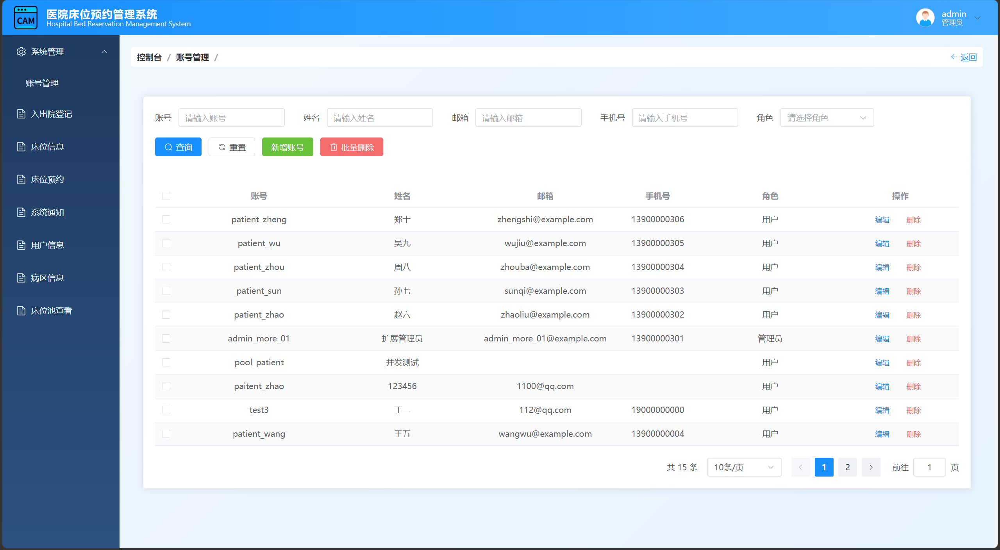
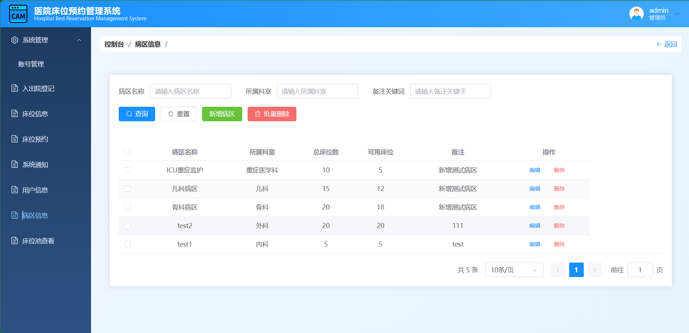
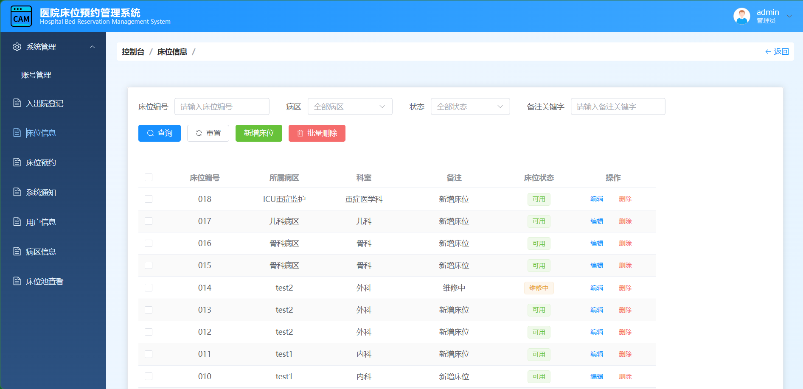
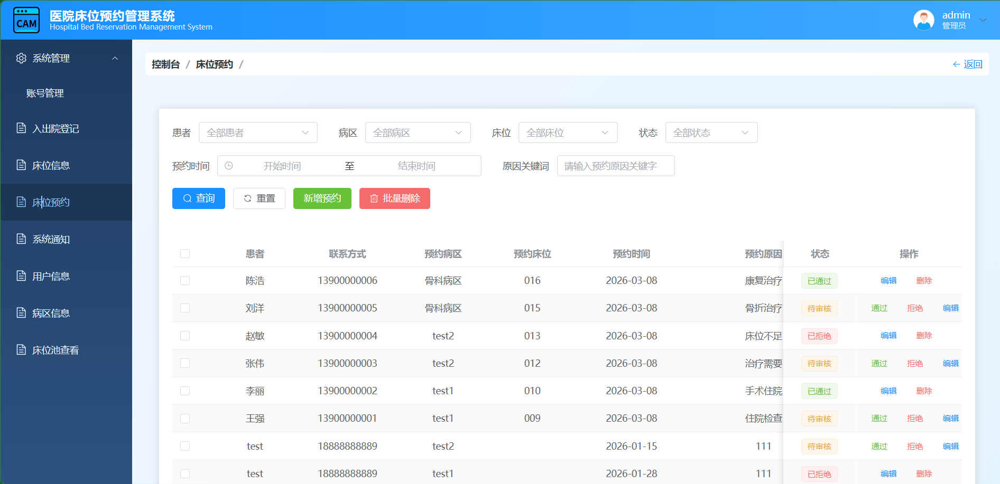
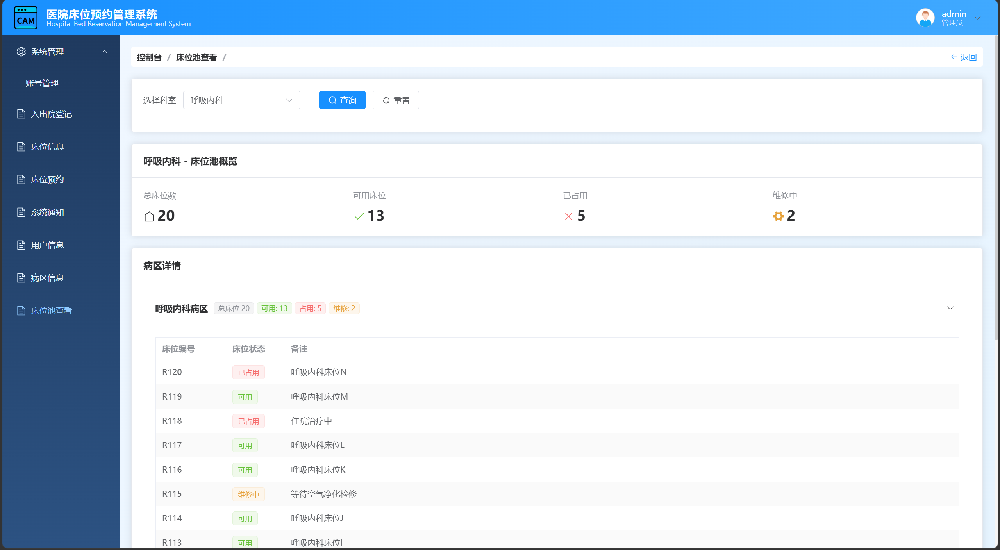
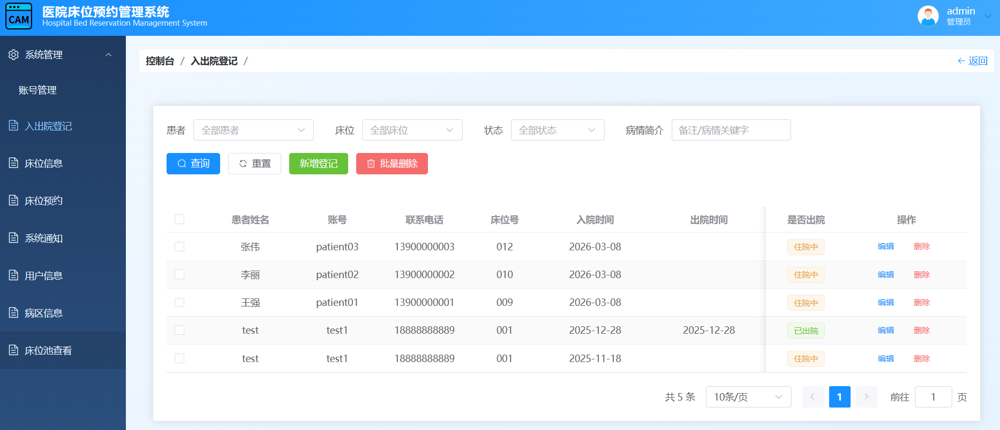
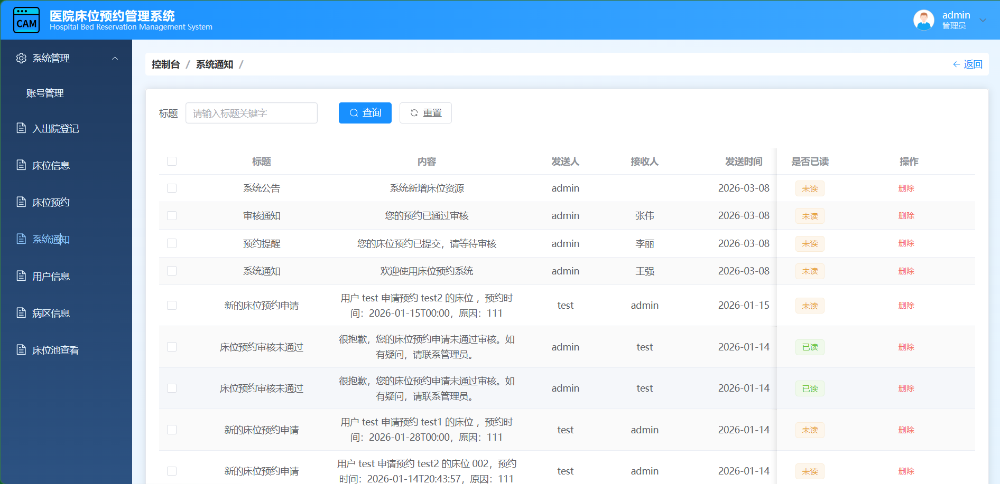
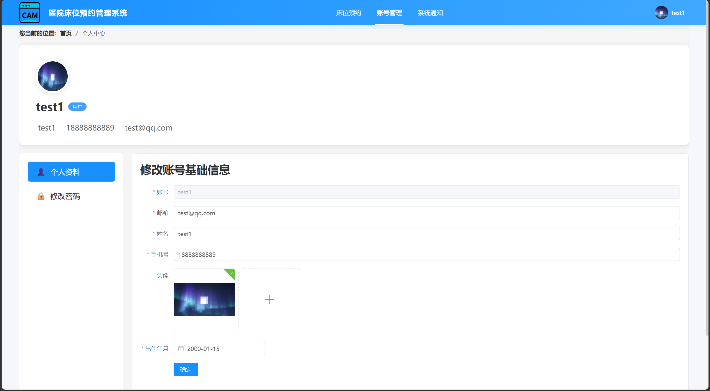
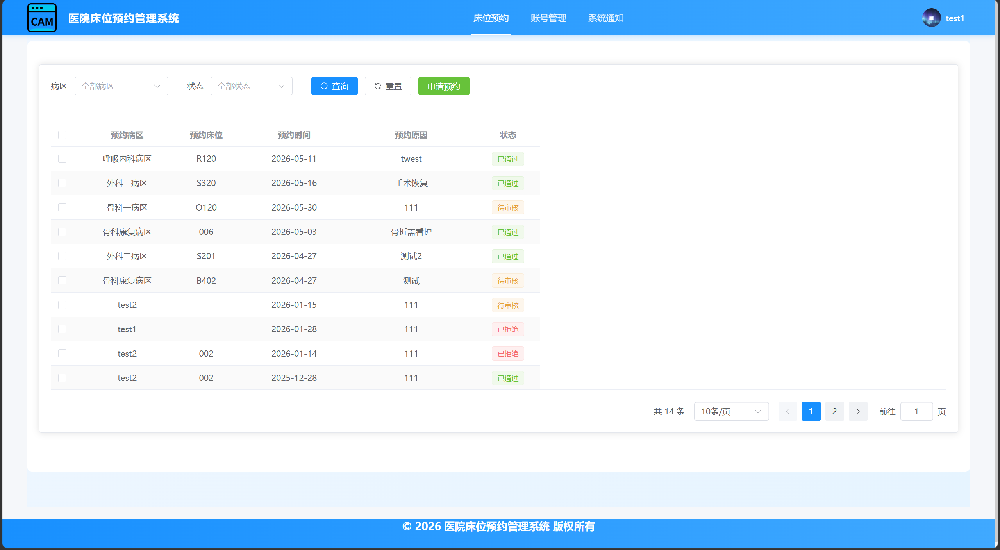
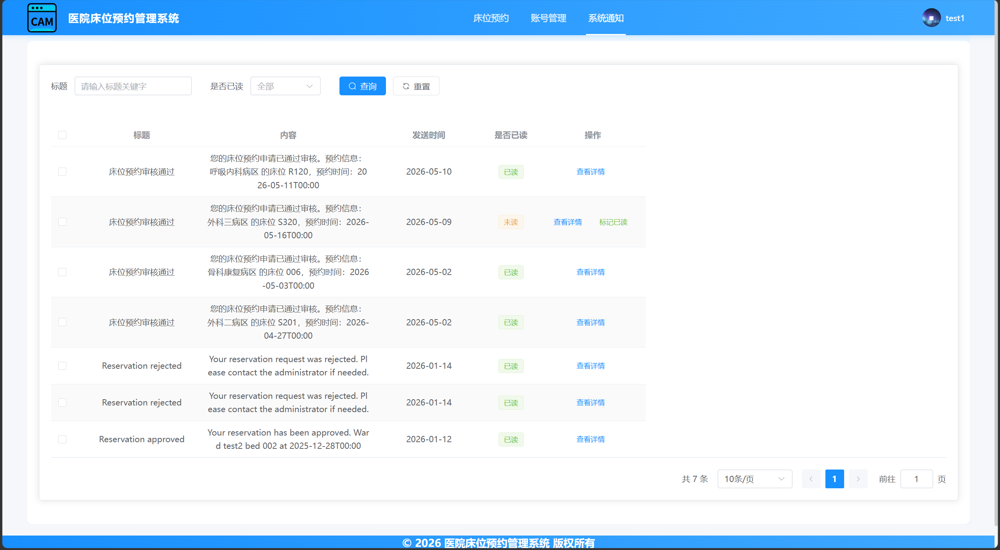

# 基于 Spring Boot + Vue 的医院床位预约管理系统

一个面向医院床位预约与床位资源管理场景的前后端分离项目，包含管理员后台和普通用户前台。

本项目支持病区管理、床位管理、床位预约、床位池查看、自动分配床位、出入院登记、系统通知、权限管理等功能，适合作为课程设计、毕业设计或 Java Web 管理系统项目参考。

---

## 项目结构

```text
框架/
├─ HospitalManagement.springboot     # Spring Boot 后端
├─ HospitalManagement.elementui      # Vue3 前端
└─ 示例图片                           # 项目界面示例截图
```

---

## 技术栈

### 后端

- Java 17
- Spring Boot 3
- Spring Web
- MyBatis-Plus
- MySQL
- Redis
- JWT
- Maven

### 前端

- Vue 3
- Vite
- Vue Router
- Pinia
- Element Plus
- Axios
- Sass

---

## 功能概览

### 管理员端

- 账号管理
- 用户信息管理
- 病区管理
- 床位管理
- 床位预约审核
- 床位池查看
- 出入院登记
- 系统通知管理
- 权限管理
- 角色权限关联管理

### 用户端

- 用户注册 / 登录
- 个人中心
- 床位预约
- 自动分配床位
- 系统通知查看
- 修改密码

### 核心业务亮点

- 按科室聚合病区与床位形成床位池
- 用户只选科室时可自动分配床位
- 使用 Redis 分布式锁避免并发重复分配
- 自动分配结果写入 `allocation_audit` 审计表

---

## 运行环境

建议环境：

- JDK 17
- Node.js 18+
- MySQL 8.x
- Redis 6.x / 7.x
- Maven 3.8+

---

## 快速开始

### 1. 准备数据库

数据库名称建议使用：

- `hospital_bed_reservation`


后端数据库配置文件位于：

- `HospitalManagement.springboot/src/main/resources/application.yml`

### 2. 启动后端

进入目录：

```powershell
cd HospitalManagement.springboot
```

启动项目：

```powershell
.\mvnw.cmd spring-boot:run
```

默认后端端口：

- `7245`

### 3. 启动前端

进入目录：

```powershell
cd HospitalManagement.elementui
```

安装依赖：

```powershell
npm install
```

启动开发环境：

```powershell
npm run dev
```

---

## 配置说明

### 前端环境变量

参考文件：

- `HospitalManagement.elementui/.env.example`

示例：

```env
VITE_API_BASE_URL=http://localhost:7245
```

### 后端环境示例

参考文件：

- `HospitalManagement.springboot/.env.example`

说明：

- 当前项目主要仍通过 `application.yml` 配置数据源与 Redis
- `.env.example` 只作为部署参数示例说明

---

## 数据库核心表

核心业务表包括：

- `user`
- `ward`
- `bed`
- `bed_reservation`
- `admission`
- `notification`
- `permission`
- `role_permission`
- `allocation_audit`

扩展表包括：

- `bed_pools`
- `bed_pool_members`
- `reservation_waitlist`

---

## 床位池功能说明

当前项目中的床位池采用“按科室聚合病区与床位”的逻辑实现方式：

1. 管理员在前端选择科室
2. 后端按 `department` 查询该科室下所有病区
3. 再汇总这些病区下的全部床位
4. 统计可用、占用、维修中的床位数量
5. 返回前端进行统计展示与明细展示

同时，这套逻辑也被自动预约分配功能复用：

- 用户只选择科室时，系统自动在该科室范围内查找可用床位并完成分配

---

## 系统截图

### 管理员端

#### 账号管理



#### 病区信息



#### 床位信息



#### 床位预约



#### 床位池查看



#### 出入院登记



#### 系统通知



### 用户端

#### 个人中心



#### 用户床位预约



#### 用户系统通知



---


## 适用场景

本项目适合用于：

- Java Web 课程设计
- 毕业设计项目展示
- Spring Boot + Vue 前后端分离练习
- 医疗管理系统类项目参考

---

## 说明

如果你需要更详细的项目分析文档，可参考：

- `PROJECT_SUMMARY.md`
